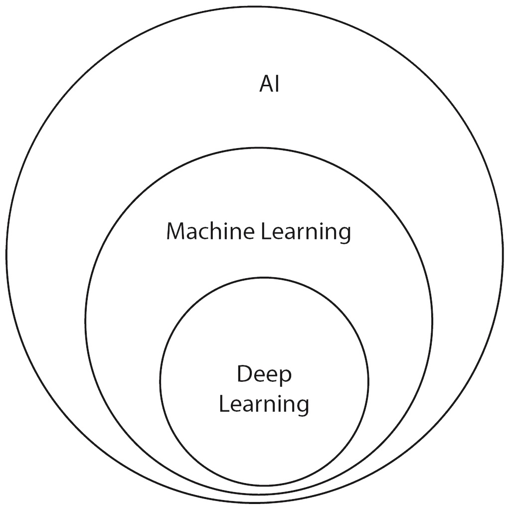
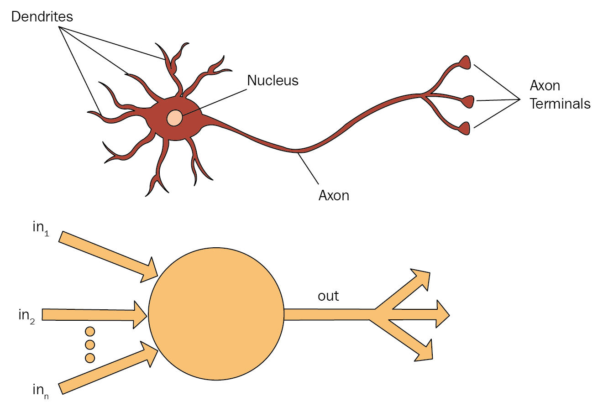

---
output:
  xaringan::moon_reader:
    seal: false
    lib_dir: libs
    css: ["default", "rladies-fonts", "resources/css/progress.css", "resources/css/adds.css"]
    nature:
      ratio: "16:9"
      highlightStyle: github
      highlightLines: true
      countIncrementalSlides: false
      slideNumberFormat: |
        <div class="progress-bar-container">
        <div class="progress-bar" style="width: calc(%current% / %total% * 100%);">
        </div></div>
---

```{r setup, include=FALSE}

knitr::opts_chunk$set(message = FALSE, 
                      warning = FALSE, 
                      fig.retina = 3)

```

class: inverse, left, middle

background-image: url(resources/images/cover.gif)
background-size: cover

# Deep Learning


.large[Thiago Pires | Set 2021]

---
layout: true

background-image: url(resources/images/logo-ibm.png)
background-position: 97% 3%
background-size: 7%

---
class: left middle
background-color: #00b33c

# Introdução ao Deep Learning

> Deep Learning é um subcampo da inteligência artificial que tem por objetivo criar um modelo grande de rede neurais que é capaz de fazer *decisões precisas baseada em dados*.

---
# Introdução ao Deep Learning

.pull-left[
### Hoje em dia, Deep Learning is quase onipresente na tecnologia: 

- Presente em **smart phones** (reconhecimento de voz, detecção de face, etc); 
- **Setor da saúde** (processamento de imagens médicas para diagnóstico); 
- **Carros autonomos**; etc
]

.pull-right[
### AlphaGo
AlphaGo foi o primeiro programa de computador a vencer um jogador profissional de Go.

```{r echo=FALSE, out.width="20%", fig.cap="Capa do Documentário da NETFLIX (AlphaGo, 2018)", fig.align='center'}

```

> *Há mais possibilidade de configuração em um tabuleiro de Go do que há átomos no universo*

Assim, isso torna uma IA jogar Go bastante desafiante!
]

---
# Introdução ao Deep Learning

.left-column[
### Inteligência artificial,
### Machine Learning, e
### Deep Learning
]

.right-column[
.pull-left[
```{r echo=FALSE, out.width="90%", fig.cap="Relação entre inteligência artificial, machine learning, e deep learning", fig.align='center'}

```
]

.pull-right[
>*Machine learning envolve o desenvolvimento e avaliação de uma algorítmo que possibilita um computador aprender/extrair uma função de um conjunto de dados*
]
]

---
# Introdução ao Deep Learning

.left-column[
### Conjunto de dados,
### Algorítmo, e
### Função
]

.right-column[
- **Conjunto de dados** é uma tabela onde cada linha contém um exemplo de um domínio descrito na coluna

```{r example, echo=FALSE}
dplyr::tibble(ID = c(1, 2, 3, 4),
              `Annual Incoming $` = c(150, 250, 450, 200),
              `Current Debt $` = c(-100, -300, -250, -350),
              `Credit Solvency` = c(100, -50, 400, -300)) |> 
  reactable::reactable(rownames = FALSE)
```

- **Algorítmo** define um processo para analisar um conjunto de dados e identificar padrões recorrentes no conjunto de dados (e.g o algorítmo pode encontrar um padrão que relaciona renda pessoal anual e débito atual à score de solvência de crédito) 
- **Function** é associação determinística de um conjunto de valores de entrada (input) para um ou mais valores de saída (output)

$$
f(\text{input}) = \text{output}
$$
]

---
# Introdução ao Deep Learning

### Função

.pull-left[
Um algorítmo de machine learning é um processo de busca a fim de escolher a melhor função que se ajusta ao conjunto de dados

$$
\begin{align}
f(\text{input}) &= \text{output}  \\
f(5, 5) &= 25 \\
f(2, 6) &= 12 \\
f(4, 4) &= 16 \\
f(2, 2) &= 4
\end{align}
$$
*What is the best function/operation?*
*Qual é a melhor função/operação*
]

--
.pull-right[

**Multiplicação** é a melhor escolha aqui!

$$
\begin{align}
5\times 5 &= 25 \\
2\times 6 &= 12 \\
4\times 4 &= 16 \\
2\times 2 &= 4
\end{align}
$$
]

---
# Introdução ao Deep Learning

### Supervisionado, Não supervisionado, and Aprendizado por reforço

#### Supervisionado
No aprendizado de máquina supervisionado, cada exemplo no conjunto de dados é rotulado com o valor alvo esperado.

#### Não supervisionado
No aprendizado de máquina não supervisionado, não há rótulo e geralmente é usado para agrupar dados.

#### Aprendizado por reforço
Um agente precisa aprender uma política de como deve agir em um ambiente para ser recompensado. O objetivo do agente é aprender com base na sua observação atual e estado do ambiente para que ação ele deve tomar.

---
# Fundamentos Conceituais

.pull-left[
**Deep Learning** é um modelo matemático que foi inspirado pela estrutura do cérebro. O cérebro humano é composto por um grande número de células nervosas chamadas de neurônios (estimativas dizem algo em torno de 100 bilhões)
]
.pull-right[
```{r echo=FALSE, out.width="90%", fig.cap="Relação com um neurônio de um cérebro humano", fig.align='center'}

```
]

Um neurônio funciona de forma simples. Se o estímulo de entrada é forte o bastante, então é transmitido um pulso elétrico (potencial de ação) para o outro neurônio em seu terminal.

---
# Fundamentos Conceituais

.pull-left[
>**Uma rede neural artificial consiste no processamento de informação em uma rede de simples unidades de neurônios.** *O poder da rede não é resultado de um modelo matemático complexo, mas na interação de vários simples neurônios.*

Deep Learning é uma rede neural artificial que tem muitas camadas ocultas.

]
.pull-right[
```{r echo=FALSE}
DiagrammeR::grViz("resources/images/mlp.gv")
```
]

---
# Fundamentos Conceituais

### Aplicação

```{r example, echo=FALSE}
```

#### Processo de aprendizagem do modelo

$$
\begin{align}
\text{solvency} &= \text{income}\times \text{weight for income} + \text{debt}\times \text{weight for debt} \\
\text{solvency} &= \text{income}\times 3 + \text{debt}\times 1\quad (\text{chute inicial dos pesos}) \\
 &= 150\times 3 + (-100)\times 1 = 350
\end{align}
$$

O erro do modelo é de $100 - 350 = -250$